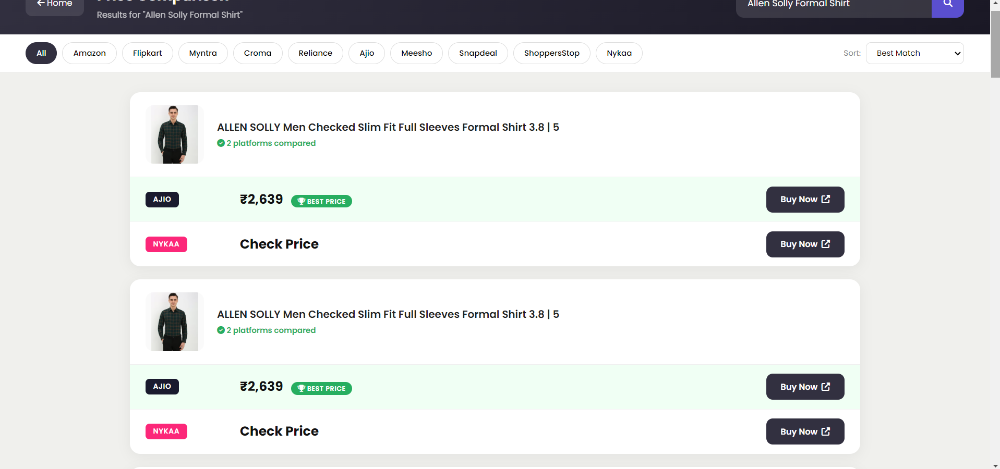

# Gridora

Gridora is a comprehensive price comparison web application that aggregates real-time product data from **10 multiple e-commerce platforms**. It combines Node.js scraping (Cheerio & Puppeteer Stealth), a Python subprocess bridge for advanced bot-protection (Cloudflare/Akamai bypass), and LLM-powered data cleaning (via Groq AI) to deliver clean, grouped product comparisons to a lightning-fast static frontend.

### Supported Platforms
Amazon, Flipkart, Myntra, Croma, Reliance Digital, Ajio, Nykaa, Meesho, Snapdeal, and Shoppers Stop.

---

## Architecture Overview

Gridora uses a decoupled **Client-Server Architecture**:
1. **Frontend (Client)**: A static Single Page Application (SPA)-style UI built with HTML, CSS, and Vanilla JavaScript. It uses `localStorage` for fast authentication state and dynamically loads layout components.
2. **Backend (Server)**: A **Node.js Express API** (`server.js`) that acts as the core engine. It manages concurrent scraping across the 10 platforms.
   - **Puppeteer Stealth & Cheerio**: Handles scraping for standard and JavaScript-heavy sites.
   - **Python Bridge (`python_bridge.py`)**: Uses `cloudscraper` to bypass strict TLS fingerprinting and CAPTCHAs on heavily protected sites (like Flipkart and Reliance Digital).
   - **Groq AI fallback**: The raw data is intelligently grouped and cleaned using the Groq API (`llama-3.1-8b-instant`).

---
# Screenshots

## Landing Page


---

## Main Dashboard


---

## Search Results Page



---

##  Getting Started

Follow these steps to set up and run Gridora on your local machine.

### Prerequisites

You will need the following installed on your system regardless of your OS:
- **Node.js (v18+) and npm**
- **Python 3.8+**
- **MongoDB Atlas Account URL** (for saving search histories)
- **Groq API Key** (for data clustering)

---

### 1. Environment Setup

Create a file named `.env` in the root directory and configure your API keys and database URIs:

```env
# .env
GROQ_API_KEY=your_groq_api_key_here
MONGODB_URI=mongodb+srv://<username>:<password>@cluster0.../gridora?retryWrites=true&w=majority
```

---

### 2. Installation (OS Specific)

####  macOS &  Linux

1. **Install Node.js dependencies**:
   Open a terminal in the project directory and run:
   ```bash
   npm install
   ```

2. **Install Python dependencies (Python Bridge)**:
   It is recommended to use a virtual environment.
   ```bash
   python3 -m venv .venv
   source .venv/bin/activate
   pip install requests beautifulsoup4 cloudscraper python-dotenv
   ```

####  Windows

1. **Install Node.js dependencies**:
   Open PowerShell or Command Prompt in the project directory and run:
   ```cmd
   npm install
   ```

2. **Install Python dependencies (Python Bridge)**:
   It is recommended to use a virtual environment.
   ```cmd
   python -m venv .venv
   .venv\Scripts\activate
   pip install requests beautifulsoup4 cloudscraper python-dotenv
   ```

---

##  Running the Application

Because of the decoupled architecture, the Node.js backend and the static frontend run independently. You must run **both** for the app to function.

### Step 1: Start the Backend Server

Ensure your terminal (with the activated Python virtual environment) is in the project directory, then start the Express server. *(Note: The Node.js server automatically calls the Python scripts when needed, so you only need to run the Node server).*

**macOS / Linux:**
```bash
source .venv/bin/activate
node server.js
```

**Windows:**
```cmd
.venv\Scripts\activate
node server.js
```

*The server will start on `http://localhost:3000` and expose the `/api/compare` endpoint.*

### Step 2: Launch the Frontend

Since the frontend is built using static HTML/JS/CSS, you can serve it using a lightweight HTTP server to prevent CORS issues. Open a **new terminal window** in the project directory and run:

**macOS / Linux:**
```bash
python3 -m http.server 8080
```

**Windows:**
```cmd
python -m http.server 8080
```

Then, visit `http://localhost:8080/index.html` in your web browser.

---

##  How to Use

1. **Dashboard**: Navigate to `http://localhost:8080/index.html`. It will redirect you to `main.html`.
2. **Account**: Create a dummy account via the "Login/Register" dialog. Credentials are saved locally to your browser.
3. **Search**: Search for any product (e.g., "iphone"). The frontend will redirect to `search.html?q=iphone`.
4. **Scraping Engine**: The backend will concurrently spin up Node.js, Puppeteer, and the Python bridge to scrape all 10 platforms. The results are aggregated and grouped intelligently, returning beautiful comparison cards.
